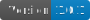

# macOS Developer Setup Script

This script automates the setup of a macOS environment for software development. It installs essential tools, programming languages, databases, and utilities, configures Zsh with the Powerlevel10k theme, and ensures compatibility with Nerd Fonts for a visually appealing terminal experience.





## 🐚 Bash Script

This project includes a setup script written in **Bash** to automate the macOS developer setup process.

This project is a macOS setup automation script designed to simplify the developer onboarding process.

---

## Features

- Installs **Xcode Command Line Tools** for macOS development.
- Sets up **Homebrew** for package management.
- Installs essential tools like `git`, `curl`, `zsh`, and others.
- Installs popular programming languages: Python, Node.js, Ruby, Go.
- Configures Python with `pyenv`, `poetry`, and `pipx` for dependency management.
- Installs databases: PostgreSQL, MySQL, and SQLite.
- Installs and configures **Docker**.
- Installs popular browsers and developer tools:
  - **Visual Studio Code**
  - **iTerm2**
  - **Slack**, **Zoom**, and **Notion**
- Configures **Zsh** with:
  - **Oh My Zsh**
  - **Powerlevel10k** theme
  - Plugins: `zsh-syntax-highlighting` and `zsh-autosuggestions`
- Installs and configures **Nerd Fonts** for terminal icons.
- Configures **Visual Studio Code** to use the Nerd Font in the terminal.
- Installs global Node.js packages: `yarn`, `eslint`, `prettier`.
- Configures Git with your username and email.

---

## Requirements

- macOS system (Intel or Apple Silicon).
- Internet connection.

---

## Installation

1. Clone this repository or copy the script file:
   ```bash
   git clone https://github.com/your-repo/mac-dev-setup.git
   cd mac-dev-setup
   ```

2. Make the script executable:
   ```bash
   chmod +x setup_dev_mac.sh
   ```

3. Run the script:
   ```bash
   ./setup_dev_mac.sh
   ```

4. Restart your terminal after the script completes.

---

## Configuration

### Git

Update your Git configuration in the script:
```bash
git config --global user.name "Your Name"
git config --global user.email "your.email@example.com"
```

### Visual Studio Code

The script automatically configures the terminal font to use `MesloLGS NF`. If you need to tweak other settings, open VS Code settings (`Cmd + ,`) and edit the preferences.

---

## Troubleshooting

- **Nerd Fonts not displaying correctly**: Ensure the `MesloLGS NF` font is installed in `~/Library/Fonts`.
- **VS Code terminal issues**: Restart Visual Studio Code after running the script.
- **Powerlevel10k configuration**: Run the following command to reconfigure:
  ```bash
  p10k configure
  ```

---

## Customization

Feel free to modify the script to include additional tools or configurations. For example, you can add:
- Additional VS Code extensions.
- Specific programming language libraries.
- Custom terminal or editor settings.

---

## License

[](LICENSE)

This project is licensed under the [MIT License](LICENSE). You are free to use, modify, and distribute this software in accordance with the terms specified in the license.


---

## Author

Rahul Kumar
rahulkumar.aws@gmail.com
[Your Website or GitHub Profile](https://github.com/rahulkumar-aws)
